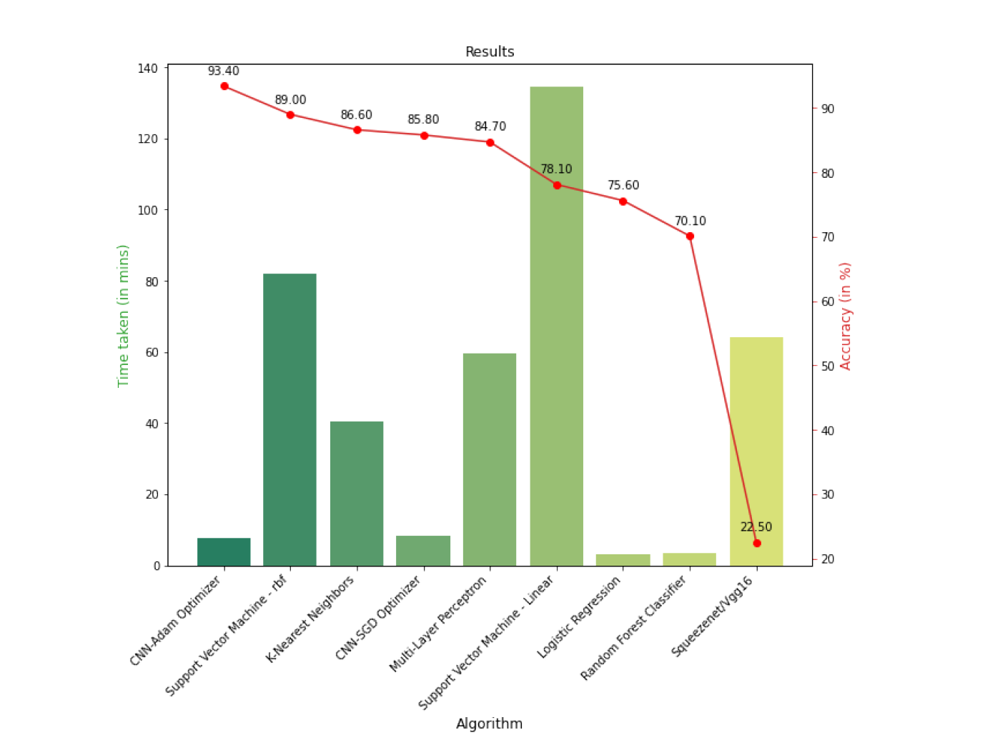

# Comparative-Study-of-Image-Classification-Algorithms-used-in-AI-Doodling
Done as a part of Artificial Intelligence (CS7IS2) module, Trinity College Dublin

The project analyzes the performance of a diverse set of algorithms in predicting hand-drawn doodles using a subset of the dataset retrieved from Google's online game "Quick, Draw!". The experiments are carried out using Convolutional Neural Networks, K-Nearest Neighbors, Support Vector Machine, Logistic Regression, Multi-Layer Perceptron and Random Forest Classifier. A comparative study is, then, carried out amongst the algorithms based on time and code complexity and using Accuracy and Confusion Matrix as the evaluation metrics.

Dataset can be found here: https://github.com/googlecreativelab/quickdraw-datase

Result:

  
